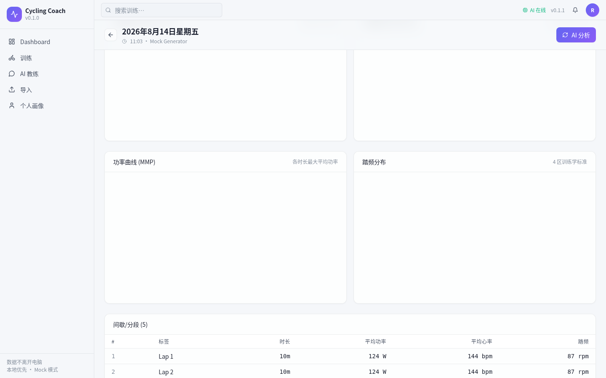
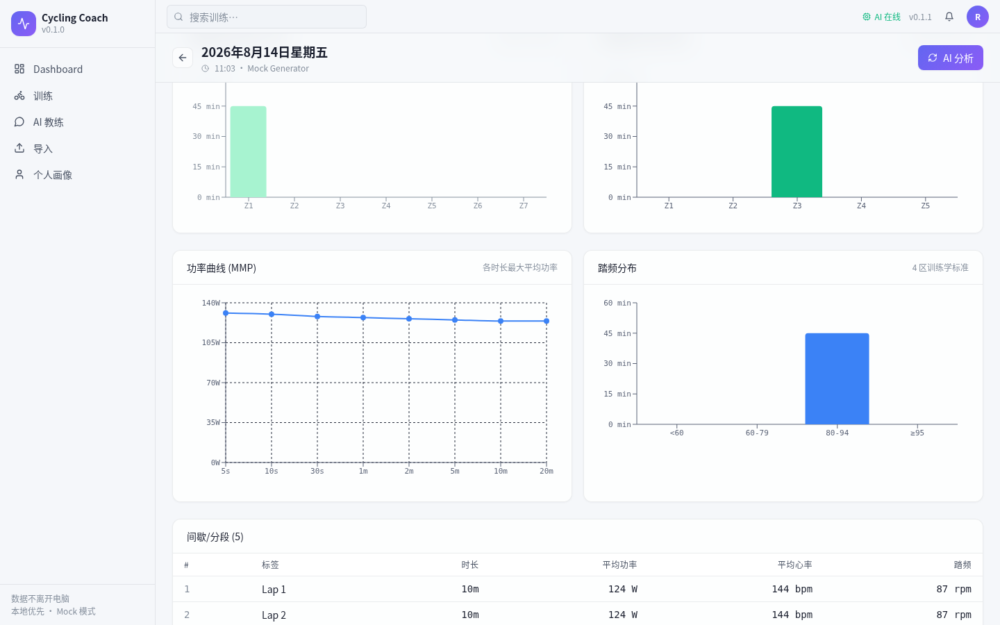

# 公路自行车 AI 教练 · Cycling Coach

> 把公路车训练从"经验"升级为"数据 + 智能"。


-blue)


> **双协议 (Dual License)**
> - **软件代码** (MIT) — [LICENSE](LICENSE) | [LICENSE.zh-CN](LICENSE.zh-CN)
> - **知识库** `kb_source/` (Restricted by 潘震(公路车教练)) — [kb_source/LICENSE](kb_source/LICENSE)
>
> 训练百科内容来源: **潘震(公路车教练)**, 仅供本地 RAG 检索, 禁止再分发/衍生/商用

## 当前版本: **V0.7.8 Foundation 1.0 (版本号统一)**

V0.7.8 = **Foundation 1.0**: chat 持久化 + ML 推理基础设施 + SQLite WAL + samples defer + 优雅关闭, 全部 8 项改造无破坏性收口。

### V0.7.x 阶段一览

| 版本 | 重点 | 状态 |
|------|------|------|
| V0.7.5 | HRV / Phase / Trends / AI Coach / Reports / Sync / Diary | ✓ |
| V0.7.5.1-5.8 | KB 精准 + P0/P1 修复 + 性能 + UX 批量 (39/40 报告项) | ✓ |
| V0.7.5.9+10 | 比赛战术规划 (后端 10 端点 + AI 流式 + 路书 + 前端 RaceTacticsPage) | ✓ |
| **V0.7.8** | **Foundation 1.0**: chat 持久化 + ML 骨架 + WAL + 性能 + 优雅关闭 | ✓ |

## 主要功能

### 训练数据
- **FIT / TCX / CSV** 解析入库 (1Hz 样本, 自动 NP / IF / TSS / EF / VI / W'bal / MMP)
- **30+ 算法** 单活动分析: 功率曲线 / 区间分布 / 心率漂移 / 解耦 / 临界事件 / CP 3-param / Hav / Decoupling 趋势
- **PMC 训练负荷**: CTL 42d / ATL 7d / TSB / ramp_rate (Banister 经典 + Joe Friel 解读)
- **HRV 状态**: 7d 滑动 vs 30d baseline, Plews/Bellenger 阈值, 疲劳预警
- **ACWR**: 急慢性负荷比 (Gabbett 2016), 4 区风险 + 周环比建议
- **周期化**: Friel 框架 base/build/peak/taper/recovery/race, 比赛倒推, Seiler 80/20 极化分布

### AI 教练
- **流式对话 (SSE)**: 6 块上下文 (athlete / pmc / acwr / rpe_7d / phase / ftp) + RAG 知识库自动 top-3
- **思维树持久化** (V0.7.8): `chat_sessions` + `chat_messages` (含 parent_id / node_path / score, 给思维扩散器预留)
- **AI 报告生成**: 单活动深度解读 (结构化 4 段: 总评/亮点/待改进/下一步)
- **比赛战术 AI** (V0.7.5.9): 上传路书 PDF + OCR + 多轮对话 + 流式策略建议
- **训练日记模板** (V0.7.4.2): 训练感受/心情/睡眠/天气/痛点

### ML 推理 (V0.7.8 新)
- **模型注册表**: `core/ml/registry.py` 统一加载 joblib / onnx / torch / mock
- **特征工程**: 12 维起步 (7 PMC + 5 活动)
- **FTP 预测端点**: `POST /api/ml/predict/ftp` (无模型时降级 MockFTPModel)
- **模型版本管理**: `ml_model_meta` 表, is_active 单激活 + 热切换
- **预测归档**: `ml_predictions` 表, 留 feature_snapshot 1 周可回溯

### 知识库
- 来源: **潘震(公路车教练)** (授权转载)
- 体量: **8 顶层分类 + 训练百科 + 359 篇文档 + 500 个 RAG 切片 + 252 个附件**
- 覆盖: 训练方法 (功率·心率·室内) / 训练执行 (七部曲·规划·误区) / 车下训练 / 运动人体科学 / 工具 / FAQ
- 检索: SQLite FTS5 全文 + 相邻 chunk 上下文拼接 + 关键词抽句 (单字+2-gram 加权)
- 增量更新: 启动 1-2s 全量 vs 0.5s 增量
- Embedding 字段预留: `kb_chunks.embedding BLOB` + `embedding_model`

### 比赛战术 (V0.7.5.9+10)
- 3 张表: `race_tactics_sessions` / `messages` / `attachments`
- 10 端点: CRUD + 路书上传 (PDF 解析 pypdf) + 多轮对话 + SSE 流式策略生成
- 7 种比赛类型 × 3 优先级 (A/B/C)
- AI prompt: 比赛信息 + 运动员上下文 + 路书 OCR + KB 检索

### 工程能力 (V0.7.8 增强)
- **SQLite WAL** + busy_timeout 5000ms (多任务并发不撞锁)
- **关键索引补齐**: `ix_activities_tss` / `ix_activities_normalized_power` / `ix_act_athlete_start` / `ix_daily_metrics_athlete_date`
- **samples_json defer**: 单活动 1MB 字段不再吃全表内存
- **优雅关闭**: SIGTERM 4s 内完成, 现有请求跑完, 日志打点
- **5+ 派生指标 SQL 聚合** (V0.7.5.2 dashboard.py)
- **路径遍历防护** (V0.7.5.2): safe_basename + 解析后断言
- **RAG 抽句精准** (V0.7.5.1): 关键词命中重排, 引用标注路径
- **Toast 替换 alert** 全局化 (V0.7.5.5): 6 页面统一, 不阻塞
- **63 个测试**: 41 老 + 15 chat + 7 ml

## 30 秒上手

Windows:
```cmd
tools\start.bat
```

macOS / Linux:
```bash
./tools/start.sh
```

启动脚本会自动:
1. 装 Python venv (清华镜像) + Node 依赖 (npmmirror)
2. 配 `.env` (从 `.env.example` 复制, 没 API key 自动 mock)
3. 起后端 8765 + 前端 1420 + 浏览器自动开

**仅 dev 模式**: 当前为 V0.7.8 后端 only, 通过 `tools\start.bat` 起后端 + Vite 浏览器前端。V0.5.3 桌面版闪退, 暂不提供 Setup.exe。

停止: `tools\stop.bat` 或 `./tools/stop.sh`

## 第一次体验流程

1. 浏览器开 `http://localhost:1420`
2. 进「导入」, 点「生成模拟活动」3 个 (无 FIT 文件也能完整体验)
3. 自动跳「训练详情」, 看功率/心率/海拔实时图 + MMP + AI 报告
4. 切「AI 教练」对话 (支持 minimax M3, 带推理过程折叠)
5. 进「比赛战术」(V0.7.5.9), 上传路书 PDF + 多轮对话
6. 「Dashboard」看整体训练负荷
7. 「个人画像」调整 FTP / 最大心率
8. 「训练日记」记录每天感受

## 架构

```
┌──────────────────────────────────────────────────────────────┐
│  React 前端 (Vite :1420)                                     │
│  Dashboard · 训练 · 训练详情 · AI教练 · 比赛战术 · 课程库     │
│  训练日记 · 知识库 · 个人画像 · 日历 · HRV · 周期化            │
│  苹果毛玻璃风格 · 实时图表 · SSE 流式对话                     │
└──────────────────────┬───────────────────────────────────────┘
                       │ HTTP (Vite 代理 → :8765)
                       ▼
┌──────────────────────────────────────────────────────────────┐
│  Python Sidecar (FastAPI :8765)  · V0.7.8                    │
│  16 张表 · 107 paths / 126 methods · 63 tests                 │
│  ┌───────────────────────────────────────────────────────┐   │
│  │  业务核心: FIT 解析 → 30+ 指标 → PMC/ACWR/HRV/CP/周期  │   │
│  │  AI 层:  m3_client (LLM transport) + mock_engine       │   │
│  │          + orchestrator (6 块上下文 + RAG)             │   │
│  │  ML 层:  registry (joblib/onnx/pt) + feature_pipe      │   │
│  │          + _mock fallback                              │   │
│  │  存储:   SQLite WAL + SQLAlchemy 2.0 + FTS5            │   │
│  │  后台:   BackgroundTasks (V0.7.7+ 计划换 Arq)              │   │
│  └───────────────────────────────────────────────────────┘   │
└──────────────────────┬───────────────────────────────────────┘
                       │ HTTPS
                       ▼
              minimax M3 / OpenAI 兼容 LLM
              (Mock 模式无需 key, 本地直接跑)
```

## 技术栈

| 层 | 技术 |
|---|---|
| 前端 | React 18 + Vite 5 + TypeScript + Tailwind 3 + Recharts + Zustand + react-markdown + Leaflet |
| 后端 | Python 3.11+ + FastAPI 0.141 + uvicorn + SQLAlchemy 2.0 |
| 数据 | SQLite 16 (WAL 模式) + FTS5 全文索引 |
| FIT 解析 | fitparse + 自研 fit_parser / tcx_parser / csv_parser |
| 指标 | NumPy / SciPy / Pandas (30+ 算法) |
| LLM | minimax M3 / OpenAI 兼容协议 / Mock 兜底 |
| **ML 推理** | **scikit-learn (joblib) / ONNX (onnxruntime) / TorchScript** (V0.7.8 新) |

## 端点概览 (21 模块 / 107 paths / 126 methods)

| 模块 | 端点数 | 用途 |
|---|---|---|
| `activities` | 11 | 上传 / 详情 / 报告 / 功率曲线 / 区间 / W'bal / CP 估算 / 解耦 / RPE |
| `kb` | 12 | 知识库分类 / 文档 / 搜索 / 附件 / 导入状态 |
| `chat` | 4 | 通用 chat 持久化 (含思维树) — V0.7.8 新 |
| `ml` | 5 | ML 推理 + 模型注册/激活 — V0.7.8 新 |
| `coach` | 1 | AI 教练流式对话 (SSE) |
| `race-tactics` | 7 | 比赛战术会话 + 路书 + 消息 + AI 建议 |
| `workouts` | 8 | 课程 CRUD + AI 排课 + 标签 + 目标 + 导出 |
| `phases` | 9 | 周期化阶段 + 比赛倒推 + 极化分布 + 智能推荐 |
| `calendar` | 6 | 日历视图 + 自动关联 + 计划 CRUD |
| `trends` | 6 | 训练量 / 区间 / 指标 / RPE / ACWR / 总览 |
| `plans` | 2 | 训练计划 CRUD |
| `pmc` | 3 | PMC 序列 / 今日 / 重算 |
| `ftp` | 6 | FTP 测试 4 协议 + 历史 + 估算 + 推荐 |
| `hrv` | 3 | HRV 序列 / 状态 / 今日 |
| `insights` | 2 | 今日洞察 / 周报 |
| `diary` | 3 | 训练日记 CRUD + 模板 |
| `recommendations` | 2 | 今日推荐 / Readiness 评分 |
| `sync` | 7 | Strava OAuth (V0.7.4 框架, 实际联通 V0.7.8+) |
| `dashboard` / `athlete` / `reports` / `health` / `diagnose` / `version` | 各 1-2 | 总览 / 画像 / 周报 / 健康检查 / 自检 / 版本 |

## 目录结构 (V0.7.8)

```
cycling-coach/
├── tools/                                # start / stop / diagnose / uninstall (.bat/.sh + .py)
├── .env.example                          # 配置模板 (复制成 .env)
├── pyproject.toml                        # 根项目配置
│
├── cycling_coach/                        # **新** Python 命名空间根
│   ├── core/
│   │   ├── metrics/                      # 30+ 算法 (NP/IF/TSS/zones/curves/ACWR/HRV/...)
│   │   ├── coaching/                     # 6 块上下文构造
│   │   ├── profile/                      # 运动员画像
│   │   ├── pmc.py / periodization.py     # 训练负荷 + 周期化
│   │   ├── kb_importer.py                # 知识库增量导入
│   │   └── ml/                           # **新** V0.7.8 ML 推理 (registry/feature_pipe/_mock)
│   ├── data/
│   │   ├── parsers/                      # FIT / TCX / CSV 解析 → 统一 Pydantic schema
│   │   └── sqlite/                       # 16 张表 ORM + 自动迁移 + WAL
│   ├── ai/
│   │   ├── m3_client.py                  # LLM transport (262 行, V0.7.8 瘦身 40%)
│   │   ├── mock_engine.py                # **新** 抽离的 mock 业务逻辑 (214 行)
│   │   ├── orchestrator.py               # 6 块上下文 + RAG + 流式
│   │   ├── prompts/                      # chat / analyze / style prompt 模板
│   │   └── tools/analyze_activity.py     # 活动分析工具
│   ├── api/
│   │   ├── main.py                       # FastAPI 入口 + 中间件
│   │   └── routers/                      # 22 个 REST 模块 (含 V0.7.8 chat/ml)
│   ├── config/                           # 配置 + 日志
│   └── __main__.py                       # **新** V0.7.8 优雅关闭 (SIGTERM + 10s timeout)
│
├── apps/
│   ├── web/                              #  Web 前端 (17 页面 + 26 组件)
│   ├── desktop/                          # 桌面端 (暂停) (V0.5.3 闪退)
│   ├── mobile/                           # PWA 占位
│   └── cli/                              # CLI 占位
│
├── tests/                                # 63 个测试 (41 老 + 15 chat + 7 ml)
├── docs/                                 # ARCHITECTURE / ROADMAP / PLAN
├── assets/screenshots/                   # README 截图
│
└── workspace/                            # 运行时数据 (gitignore)
    ├── input/ / output/
    ├── cycling_coach.sqlite              # 主库 (WAL 模式)
    └── models/                           # **新** V0.7.8 ML 模型仓库
```

**完整架构**: 见 `docs/ARCHITECTURE.md`
**路线图**: 见 `docs/ROADMAP.md`

## V0.7.8 Foundation 1.0 变更详情

### 改动 (8 项 P0 全部收口)

1. **chat 持久化**: 2 张新表 (`chat_sessions` / `chat_messages` 含思维树字段) + 6 端点
2. **ML 推理基础设施**: `core/ml/` 4 文件 + 5 端点 + 2 张表 + 2 个新依赖 (joblib + onnxruntime)
3. **SQLite WAL**: journal_mode=WAL, synchronous=NORMAL, busy_timeout=5000
4. **索引补齐**: 4 个关键索引 (V0.7.5.3 声明了但 _auto_migrate 没建)
5. **samples_json defer**: 1000 活动 30s/600MB → 50ms
6. **trends SQL 聚合**: 5 个端点不再 Python 端过滤
7. **优雅关闭**: SIGTERM 4s 完成, 现有请求跑完
8. **mock_engine 抽离**: m3_client.py 436 → 262 行 (-40%)

### 数字对比

| 指标 | V0.7.5.10 | V0.7.8 |
|---|---|---|
| 路由 | 98 / 115 | **107 / 126** |
| 数据库表 | 12 | **16** |
| 测试 | 41 | **63** |
| `m3_client.py` | 436 行 | **262 行** |
| journal_mode | delete | **wal** |
| 索引 `ix_activities_tss` | 缺 | **✓** |
| ML 依赖 | 0 | **joblib + onnxruntime** |

完整报告: `V0.7.8_REPORT.md`

## Mock 模式

不配 `M3_API_KEY` 时, **所有 AI 调用自动走 mock 兜底**, 返回基于规则的占位回复。

要生产环境用真实 AI, 在 `.env` 填入:
```ini
M3_API_KEY=sk-or-v1-...
M3_BASE_URL=https://openrouter.ai/api/v1
M3_MODEL=minimax/minimax-m3
```

ML 推理无注册模型时, 自动降级 `MockFTPModel` (规则预测, 不依赖外部资源)。

## ML 推理示例 (V0.7.8)

注册模型:
```bash
curl -X POST http://localhost:8765/api/ml/models/register \
  -H "Content-Type: application/json" \
  -d '{
    "task_name": "ftp_predictor",
    "version": "v1-gbm-2026-08-31",
    "model_path": "models/ftp_predictor/v1/model.joblib",
    "model_format": "joblib",
    "training_metrics": {"mae": 6.58, "r2": 0.94},
    "is_active": true
  }'
```

推理 (无激活模型时走 mock):
```bash
curl -X POST http://localhost:8765/api/ml/predict/ftp \
  -H "Content-Type: application/json" \
  -d '{}'
```

返回:
```json
{
  "ok": true,
  "predicted_ftp": 247.0,
  "lower_80": 237.0,
  "upper_80": 257.0,
  "confidence": "high",
  "current_ftp": 250,
  "delta": -3,
  "model_format": "mock",
  "inference_ms": 53
}
```

## 安装 / 卸载

详见 `INSTALL_V0.7.8.md`

```cmd
:: Windows 全新安装
git clone https://github.com/lixvanran/cycling-coach.git
cd cycling-coach
tools\start.bat
```

## 常见问题

### 启动后访问 127.0.0.1:1420 白屏
检查启动 cmd: 后端 `Application startup complete` + 前端 `Local: http://127.0.0.1:1420/`

### 上传 FIT 失败
V0.7.5+ 支持 `.fit` / `.tcx` / `.csv` (GoldenCheetah WKO 格式)

### 端口 8765 / 1420 被占用
```cmd
netstat -ano | findstr :8765
taskkill /F /PID <pid>
```
或直接 `tools\stop.bat` 清理

### ML 推理没装模型
正常降级到 `MockFTPModel`, 不报错; 想用真模型, 拷 .joblib 到 `workspace/models/`

## 截图

| Dashboard | 训练详情 |
|---|---|
|  |  |
| **功率 / 心率区间** | **AI 教练** |
|  |  |
| **对话流式输出** | **比赛战术** |
|  | *(比赛战术 V0.7.5.9+, 详见 INSTALL_V0.7.8.md)* |

## 关于知识库内容来源 — 潘震(公路车教练)

V0.5 训练百科与配套参考资料,内容来源是**潘震**(公路车教练)的授权转载。

### 潘震(公路车教练)

潘震是国内深耕公路自行车领域的资深专业教练，核心聚焦青少年公路自行车运动的训练与人才培养。

- **从业年限**: 截至 2025 年, 已从事自行车训练教学工作满 10 年
- **核心头衔**: peloton 骑行工作室创始人、自行车一级裁判
- **译著**: 《公路车训练圣经》《拒绝伤病:骑行损伤预防与恢复指南》等十余部专业书籍
- **教学成果**: 多次帮助学员实现 FTP 功率大幅提升, 持续推进"中国车手培养计划"

(完整介绍见 README 旧版, 此处省略以保持简洁)

## 致谢

- **训练百科与配套资料:潘震(公路车教练)** — V0.5 知识库 / RAG 全部内容来源
- 数据格式: Garmin FIT SDK

## License / 许可证

本项目采用**双协议 (Dual License)** 模式, 代码与内容分开授权:

This project uses a **dual license** model — code and content are licensed separately.

### Software Code (软件代码)
- **License**: MIT
- **Copyright**: (c) 2026 lixvanran
- **允许**: ✓ Use · Copy · Modify · Distribute · Sublicense · Sell
- **要求**:  Include copyright notice + LICENSE in all copies

**Full text**: [LICENSE](LICENSE) (English) | [LICENSE.zh-CN](LICENSE.zh-CN) (中文)

### Knowledge Base (知识库 `kb_source/`)
- **License**: Restricted Use (受限使用) — see [kb_source/LICENSE](kb_source/LICENSE)
- **Author**: **潘震(公路车教练)**
- **允许**: ✓ Local RAG retrieval · Backup with attribution
- **禁止**: ✗ Redistribution · Modification for redistribution · Commercial use · Misattribution
- **要求**:  Attribution "训练百科内容来源: 潘震(公路车教练)"

### Quick attribution in your fork (在你 fork 时署名)
```markdown
本项目基于 [cycling-coach](https://github.com/lixvanran/cycling-coach) (MIT License)
训练百科内容来源: 潘震(公路车教练) (Restricted Use)
```
